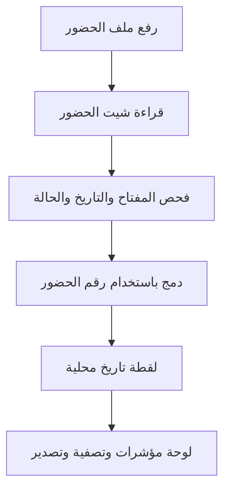

# خريطة البرنامج

## الاستئناف السريع

اقرأ: `PROJECT_GUIDE.md` ← `PROJECT_LOG.md` ← هذا الملف ← `PROJECT.json` ← `.workflow/state.json`.

## خريطة الملفات

| المسار | مسؤوليته | قاعدة التغيير |
| --- | --- | --- |
| `PROJECT.json` | خريطة شيت الحضور، المفتاح، المؤشرات والفلاتر | المصدر الأول لتغيير منطق الأعمال |
| `engine.py` | استقبال الملف، حفظ التاريخ، منع تكرار البايتات، الدمج والتراجع | محرك ثابت؛ لا يغير بلا سبب موثق |
| `calculation_engine.py` | قراءة إكسل، التحقق، الدوال، المؤشرات والرسوم | محرك ثابت؛ لا يغير بلا اختبار |
| `dashboard.html` | واجهة الرفع والعرض والتصفية والتاريخ والتصدير | لا يغير بلا اختبار تجربة المستخدم |
| `CUSTOM_RULES.py` | تحويل صف بسيط عند الحاجة | نقطة تمديد محدودة |
| `sample/HR_Time_Attendance_Demo.xlsx` | مثال حضور صناعي كامل | يستخدم في اختبار الأساس |
| `sample/HR_Attendance_Delta_Demo.xlsx` | مثال تصحيح + سجل جديد | يثبت معنى التحديث الجزئي |
| `TEST_HR_FOUNDATION.py` | اختبارات قبول الإصدار الأول | يشغل قبل التسليم |
| `.workflow/` | حالة الخطة والمهام والتسليم والأدلة | مصدر حالة التنفيذ بين الموديلات |
| `data/` | ينشأ وقت التشغيل: قاعدة التاريخ والملفات والسجل | لا يدخل حزمة التسليم |

## تدفق الحضور

## حدود V1.0

المصدر الرئيسي هو `TIM_02_DailyAttendance` بعناوين في الصف الثالث. المحرك لا يحمّل بعد تلقائيًا مصنف الموظف أو الوردية أو الإجازات في نفس العملية. الشيت الخطأ أو العمود الحرج الناقص يفشل الرفع ويحافظ على الحالة السابقة.

## ترتيب التوسعة

١. تثبيت شكل مدخل ملفات الموارد البشرية المتعددة.
٢. ربط الحضور بالوردية حسب الموظف وتاريخ العمل.
٣. إضافة الإجازة والموظف مع تواريخ السريان والمصادر.
٤. إضافة خطة العمالة والاحتياج، ثم مؤشرات الإدارة.

كل خطوة تحتاج بطاقة مهمة واختبار قبول، ولا تتجاوز سجل القرارات أو تعدّل بيانات التشغيل أثناء البناء.
